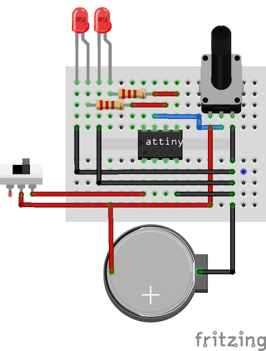

## Tiny Light

Tiny Light is a simple Arduino-based sketch that allows variable speed
blinking between two LEDs controlled by an ATtiny45/ATtiny85
microcontroller. These small controllers are suited for repetitive tasks
with source code that is no larger than 4kb or 8kb respetively - perfect
for controlling LEDs, sensors, servos, piezo elements, etc.

## Required Software

While you don't necessarily need the Arduino IDE (checkout
https://github.com/scottdarch/Arturo) to commincate with the
microcontrollers, it is perhaps the easiest approach. However, you will
need supporting files for the microcontrollers
(https://github.com/damellis/attiny). 

## Required Hardware

It is possible to program ATtiny microcontrollers using an arduino 
(http://www.instructables.com/id/Program-an-ATtiny-with-Arduino/). 
However, I prefer to use the Sparkfun AVR ATtiny programmer, which 
plugs directly into your computer's USB port
(https://www.sparkfun.com/products/11801). Other than that, all that is
needed is two LEDs, two 220 ohm resistors, and a 10k potentiometer. 

## Wiring Diagram

